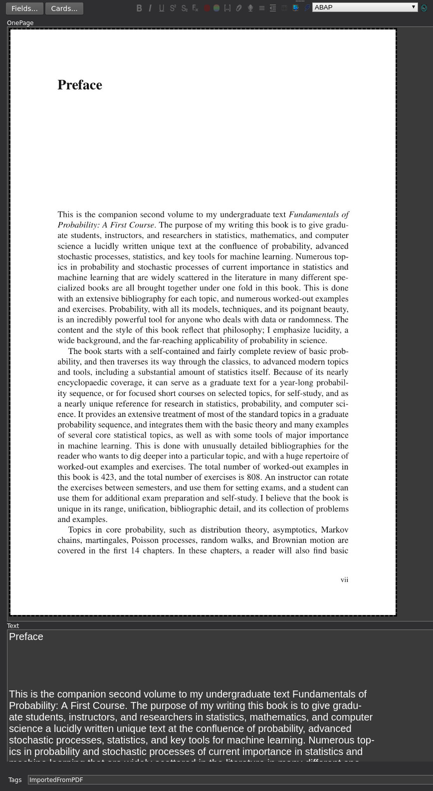
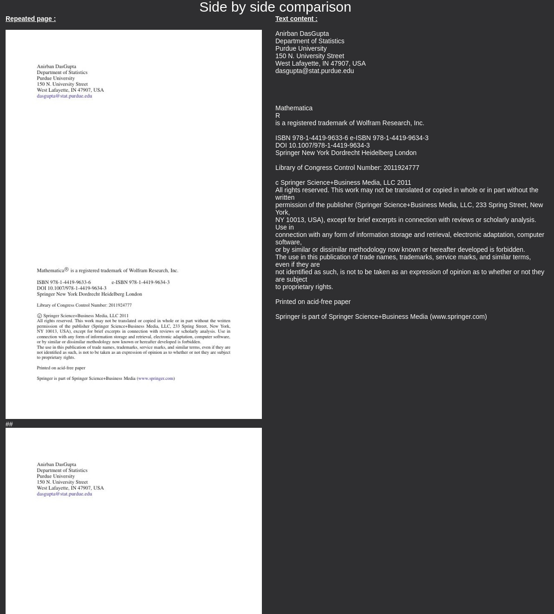

# pdf2anki
*TLDR : loads a pdf into anki, one page pere card, with image on top and text below. It **doesn't** actually OCR text, it just extracts it from the pdf. If your file doesn't contain text, you can still use [AnkiOCR](https://ankiweb.net/shared/info/450181164) afterwards.*

***READ THIS. Please make sure you understand that right now anki's servers are free to use but they were not designed for this kind of usage. PDFs like this can easily be order of magnitures larger than simple text based cards. If you use this script, please be reasonnable and use another anki profile, this way it will not be automatically synced with the servers. Thank you.***

# Main feature :
* It allows to search a specific page or your pdf using anki's browser, so you can use several words or parts of words to find a specific page.

## how does it work ?
* pdf2anki uses either the Linux command `pdftotext` extract the text from each pdf page (better layout preservation) or the package `PyPDF2` (worse)
* Anki-connect addon is used to create anki cards that contains the single page + the text
* you can then search pdfs pages using multiple words at the same time
* picture :
        
* preview screen :
        

## Guide
* run `pip install -r requirements.txt`
* *optional* on UNIX, make sure you have `pdftotext`
* make sure to have [anki connect](https://ankiweb.net/shared/info/2055492159)
* make sure anki is running
* edit the script settings to suit your needs
* run `python3 ./pdf2anki.py --username USER --PDF=filepath`
* if you have any issue, don't be afraid to tell me by opening an issue on github. Try to uncomment the debug line to output `r.json()`, it can help you figure it out on your own.

## notes :
* **why did I make this?** The idea was to make my PDF lessons searchable. I never found a way to look for a page in a pdf using several keywords at the same time. So I decided to import each page into anki and use it like that.  **But now, I don't use it that much after I discovered [recoll](https://www.lesbonscomptes.com/recoll/). It's a desktop search engine with awesome features. I added scripts to github that allow Recoll to search inside my anki database, [check it out](https://github.com/thiswillbeyourgithub/IndexableAnki)!
* I tested this on `python 3.9` and it works at least in anki 2.1.35. Don't hesitate to open an issue if this stops working after an anki upgrade.
* If you want to use it but your PDF doesn't include text and is not written by hand, you will probably be interested in the addon [AnkiOCR](https://ankiweb.net/shared/info/450181164). Just run pdf2anki (having set `add_image` to `True`) on your PDF then use AnkiOCR on those new cards. You can also use AnkiOCR to increase your search capabilities as some pictures and diagrams could be in your PDF but without text.
* please don't use this on super large pdf for no reason, or if you do : don't sync it, the creator of anki should not have to pay extra bandwidth for this not intended use so don't forget the "delete media" button. 
* you should consider installing this addon to find text easily : [highlight search results in the browser](https://ankiweb.net/shared/info/225180905)
* the way my code works, images are manually moved from the pdf folder to the anki media folder. I think anki-connect has a more elegant way of doing this but I didn't have the time to do it at the time. If you find a better way don't hesitate to do a PR.

## TODO
* support globbing of pdfs, looks very easy to do, just add a loop, WCGW
